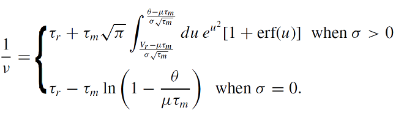

## Numerical computation of the firing rate of a LIF neuron

The firing rate of a LIF neuron receiving a Gaussian distributed noise is known analytically.

The detailed derivation can be found [here](yim_derivation_LIF.pdf).
