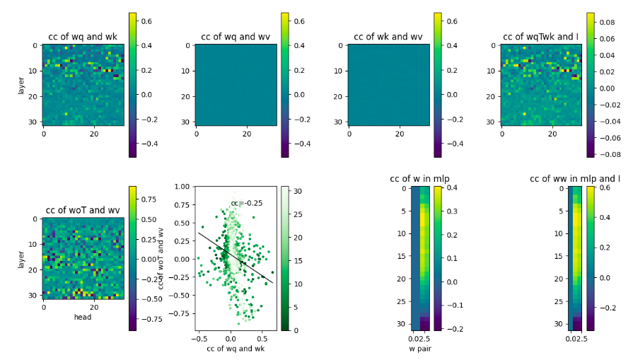

## Correlations in weights in pretrained small language models

### Abstract

Motivation:
1. Multiple studies reported that pruning certain layers, or even entire blocks, in a pretrained LLM has a minimal impact on its performance, suggesting redundancy within their model architectures.
2. Could we identify the redundancy within their model architectures by looking into the weights or correlation of weights?
3. Could we better understand the weights in different attention heads, along the layers, in attention and MLP layers?

Theory:
1. The resulting embedding in the attention layer is a function of the product of W_q and W_k, as well as the product of W_o and W_v.
2. The MLP layer has the gated W_g and up W_u projection in parallel and then the two streams are combined with elementwise multiplication and fed into down W_d projection.

Methods:
For each model, we computed the correlation coefficient (cc) of the followings in each layer:
1. W_q and W_k in different attention heads 
2. W_q and W_v in different attention heads
3. W_k and W_v in different attention heads
4. W_q^T·W_k and I in different attention heads
5. W_o^T and W_v in different attention heads
6. cc of W_o^T and W_v vs cc of W_q and W_k (M5 vs M1)
7. W_g and W_u, W_g and W_d^T, W_u and W_d^T, W_u^+ and W_d
8. W_d·W_g and I, W_d·W_u and I, W_d·(W_u^+)^T and I

Observations:
1. All the small pretrained language models we studied, ranging from 0.5B to 8B, have similar correlation structures.
2. W_q and W_k have more significant correlation in the early layers.
3. W_o^T and W_v have more significant correlation in the later layers.
4. cc of W_o^T and W_v vs cc of W_q and W_k are negatively correlated.
5. W_u and W_d^T show positive correlation in the early layers and negative correlation in the later layers.
6. W_d·W_u is close to I in some intermediate layers.

Future plans:
1. Study how the correlation structures evolve during training by looking into different checkpoints
2. Examine the changes of the correlation structures upon fine-tuning
3. Explore the functional significance of layers and attention heads with different correlations by pruning techniques
4. Investigate the correlation structures in larger language models

Results:

---
My notes

